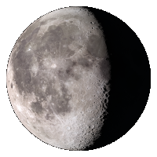

.. _custommoon :

Moon 
####

Via a special button definition you can add a picture of the current moon phase
to your dashboard. Use the following code::

    buttons = {}
    buttons.moon = {
      width:12,
      isimage:true,
      refreshimage:60000,
      image: 'moon'
    }
    columns[2] = {}
    columns[2]['blocks'] = [ buttons.moon]

As you can see it's in fact a normal button, but with image name ``'moon'``.
Dashticz will automatically use the correct image for the current moon phase from the folder
``<dashticz>/img/moon``

We have 100 moon images. A moon cycle takes approximately 28 days.
That means that the moon picture will refresh approximately 4 times a day.

